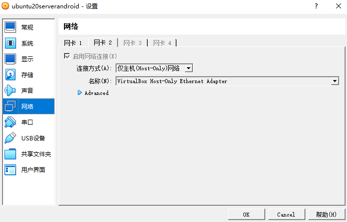
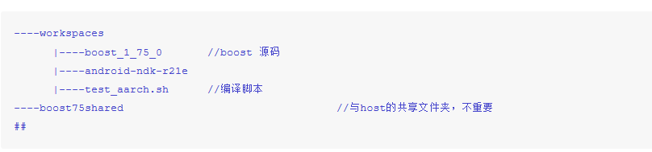
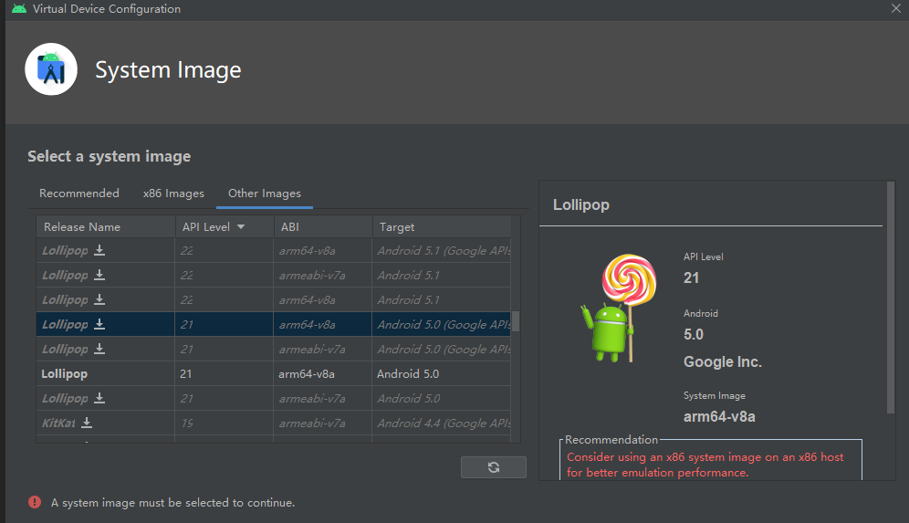

# boost的编译
* 编译[boost_1_75](https://boostorg.jfrog.io/artifactory/main/release/1.75.0/source/boost_1_75_0.tar.bz2)
* 目前只处理了静态库的情况。
* [测试代码](./testbuild/)
## Android
### 工具
[VirtualBox](https://www.virtualbox.org/) + [ubuntu 20 live server amd64 iso](https://mirrors.zju.edu.cn/ubuntu-releases/20.04.5/ubuntu-20.04.5-live-server-amd64.iso).

在Vmware上试过各种ubuntu-desktop，都不行。没有试过Virtualbox + ubuntu server的组合。总之带图形界面的desktop风险比较大。

#### 一些设置
* 设置一个host-only的网卡



* 共享文件夹
在VirtualBox设置中设置了以后，在linux上设置

```
$ sudo apt install virtualbox-guest-utils
$ sudo mount -t vboxsf [name configured in host] [directory created]
```
* 一些工具

```
$ sudo apt-get install unzip
$ sudo apt-get install ip-utils
```
参考

* [操作](https://gist.github.com/estorgio/1d679f962e8209f8a9232f7593683265)
* [命名](https://askubuntu.com/questions/1355061/shared-folder-was-not-found-vboxsf)

### 编译
* 安装linux 编译工具

```
$ sudo apt-get install build-essential linux-headers-`uname -r`
```

* 安装android 编译工具, 直接解压缩。

```
$ wget https://dl.google.com/android/repository/android-ndk-r21e-linux-x86_64.zip
```


* 我的编译环境目录结构是这样




* 编译脚本来自 [gist](https://gist.github.com/enh/b2dc8e2cbbce7fffffde2135271b10fd), 修改并使用的脚本: [test_aarch.sh](./env_vm_mac//scripts/test_aarch.sh)。

* 编译结果在 **boost_1_75_0/stage/lib/**

### 测试
* 安装 [android studio](https://developer.android.com/studio).

* [创建一个c++项目](https://developer.android.com/studio/projects/add-native-code)

* [创建一个虚拟设备](https://developer.android.com/studio/run/managing-avds#skins), 选这个设备类型，太高版本的x86模拟不了arm，太低版本的不是**v8a**


## MacOS
### 交叉编译
在ubuntu虚机上
* 用clang-darwin编在出库在mac上不能识别
* 用darwin-clang编没有darwin环境。darwin默认macOS，网上找了一下，在linux上搭建这个环境好像不是主流，没看到参考。
* 打算先搞ios再来看这个
### 在Mac mini上
这台机器已经装好了Xcode，直接就可以编译[test_mac](./env_vm_mac/scripts/test_mac.sh), 实际上使用的toolset=clang-darwin131

## iphone simulator
环境：Mac mini + Xcode.14 + iphonesimilator sdk 15.4
### 编译
* 设置toolset：将[project-config.jam](./env_vm_mac//scripts/project-config.jam) 放在 __boost_$VER/__ 目录下
* 在 __boost_$VER/__ 运行[test_iphonesim.sh](./env_vm_mac//scripts/test_iphonesim.sh)
* *.a文件生成在 __boost_$VER/stage/lib
### 测试
* 打开Xcode，创建一个__Object-C__的Hello World项目，假设项目名叫 **1234**
* 在__Frameworks__文件夹选择：添加文件到项目，选择libboost_xx.a添加
* 编译。Xcode能够识别库文件，如果版本不对会报错，类似“...libboost_xxx.a是为MACOS编译的...”
* 如果要看运行结果，要把.h和.a文件设置到项目中。以下是不正确但是能用的方法：
	1. 将.h文件放到iPhoneSimulator默认路径
	``` bash
	$ cd /Applications/Xcode.app/Contents/Developer/Platforms/iPhoneSimulator.platform/Developer/SDKs/iPhoneSimulator.sdk/usr/include 
	$ sudo mkdir boost; cd boost
	$ sudo cp -rf __boost_$VER/boost/* ./
	```
	2. 将.a文件拷贝到项目默认路径，默认路径在 __/Users/bsl/Library/Developer/Xcode/DerivedData/项目名-乱码/Build/Products/Debug-iphonesimulator/__

## 小结
目前boost编译的思路主要是：

1. 安装sdk
2. 写project-config.jam文件配置toolset，也就是指定编译器
3. 写build_xx.sh文件，主要配置一些生成库属性,flags和目录

按照这个思路，主要的问题是SDK，比如MAC是不是有可以在Ubuntu上跑的SDK。如果不可以，那么要研究一下llvm。我猜这两个最终归结到一个问题就是Apple是不是提供在别的OS上跑的后端编译工具。

## 参考
* [clang: libc++](https://stackoverflow.com/questions/8486077/how-to-compile-link-boost-with-clang-libc)
* [clang安装](https://stackoverflow.com/questions/39332406/install-libc-on-ubuntu)
* [mac: visibility](https://stackoverflow.com/questions/8685045/xcode-with-boost-linkerid-warning-about-visibility-settings)
* [lipo](https://blog.csdn.net/qq_33053671/article/details/106388313)
* [compilers](https://www.alibabacloud.com/blog/gcc-vs--clangllvm-an-in-depth-comparison-of-cc%2B%2B-compilers_595309)
* [clang](https://clang.llvm.org/get_started.html)
* [llvm](https://llvm.org/docs/GettingStarted.html#requirements)
* [Apple-Boost-BuildScript](https://github.com/faithfracture/Apple-Boost-BuildScript)
* [Boost各平台编译](https://developer.aliyun.com/article/252857#slide-1)